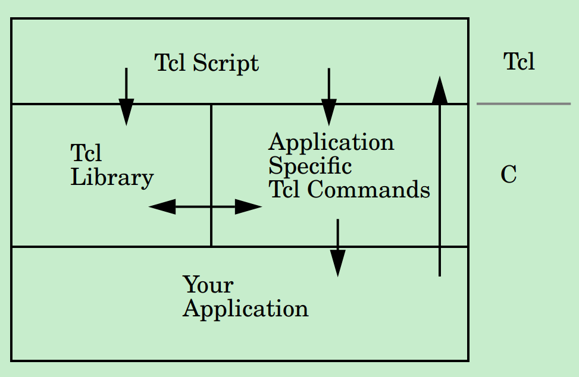

# Overview

* Tcl Library - Interpreter<br>
   * The Tcl C library implements the interpreter and the core Tcl commands such as set, while and proc.
* Application Specific Tcl Commands - Command procedures<br>
   * Application-specific Tcl commands are implemented in C or C++ and registered as commands in the interpreter.
   * The command procedures are typically thin layers over existing functionality in your application.
* Your application<br>
   * Finally, by using `Tcl_Eval`, your application can invoke functionality programmed in the script layer.
   * You can query and set Tcl variables from C using the `Tcl_SetVar` and `Tcl_GetVar` procedures.

# C call TCL
* [Example](./c_call_tcl/main.c)
* [Reference](http://phaseit.net/claird/comp.lang.tcl/HowToC.html#C_invokes_Tcl)

```c
#include <tcl.h>

int main(int argc, char **argv)
{
   char *my_string;
   Tcl_Interp *interp;

   my_string = "MagicWord";
   printf("The secret is '%s'.\n", my_string);
   interp = Tcl_CreateInterp();
   (void) Tcl_SetVar(interp, "my_string", my_string, 0);
   (void) Tcl_EvalFile(interp, "./myscript.tcl");

   return 0;
}
```

# Extend TCL with C
* [Reference](https://www.equi4.com/jcw/extuse.html)
* Tcl calling extensions
* An application calling the Tcl interpreter

There are essentially three ways to incorporate an extension:
* Create a modified version of tclsh or wish which includes the extension (static linkage)
* Create a dynamically loadable module, which many Tcl systems know how to activate (dynamic linkage)
* Define the application in C or C++, then link it to the Tcl core libraries (embedding)

# An application calling the Tcl interpreter
* [Example](./code/tcl_main/main.c)
```c
#include <tcl.h>
#include <stdio.h>

Tcl_Interp *interp;

// Application-specific command procedures
int RandomCmd(ClientData clientData, Tcl_Interp *interp, int argc, const char *argv[]) {
   printf("hello random command\n");
   return 0;
}

int Tcl_AppInit(Tcl_Interp *interp) {
   if (Tcl_Init(interp) == TCL_ERROR) {
      printf("Tcl_Init Error!\n");
      return TCL_ERROR;
   }
   Tcl_CreateCommand(interp, "random", RandomCmd, (ClientData)NULL, (Tcl_CmdDeleteProc *)NULL);
   return TCL_OK;
}

int main(int argc, char *argv[]) {
   Tcl_Main(argc, argv, Tcl_AppInit);
   return 0;
}
```

The C program create TCL interpreter which includes `random` command using `Tcl_CreateCommand`.
